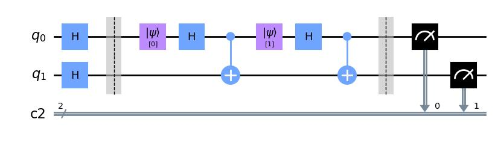

# Quantum Reservoir Computing (QRC)
Using quantum computers as reservoirs in a reservoir computer is fairly new. The current examples in the literature rely heavily on quantum circuits of a very periodic nature. This package is meant to simplify the creation and simulation of such periodic circuits.

## Installation
*qreservoirpy* will soon be uploaded to PyPI, and will then be pip-installable as

```console
 pip install qreservoirpy
```

In the meantime, you can pip install it locally. Clone the repository and navigate to the folder containing `setup.py`. Then run

```console
pip install .
```
This will install qreservoirpy, as well as the dependent packages (among others qiskit and scikit-learn)

## Interface
The interface of this package is somewhat inspired by  [reservoirpy](https://github.com/reservoirpy/reservoirpy). Consider checking out their tutorials to better understand this package.

A *reservoir* is in this package defined as a class implementing the abstract `QReservoir`. To create a *completely custom* reservoir, one needs to implement 5 functions
```python
class CustomRes(QReservoir):
    def before(self, circuit):
        pass
    def during(self, circuit, timestep):
        pass
    def after(self, circuit):
        pass

    def run(self, timeseries, **kwargs):
        pass
    def predict(self, num_pred, model, from_series, **kwargs):
        pass
```
However, `qreservoirpy` has some partially implemented reservoirs already, which have easier interfaces. See the *Examples* folder for inspiration.

## Static and Incremental
These reservoirs have implemented `run` and `predict`, leaving only `before`, `during` and `after`.

All the reservoirs created with `Static` and `Ìncremental` have the same three layered circuit structure; they begin with an initialization, which is defined by  `before`. Then, a small circuit is created for every timestep in the timeseries, which is defined by `during`. The third and last layer is defined by `after`.

```python
from qreservoirpy.reservoirs import Static
class CustomRes(Static):
    def before(self, circuit):
        circuit.h(circuit.qubits)
        circuit.barrier()

    def during(self, circuit, timestep):
        circuit.initialize(str(timestep), [0])
        circuit.h(0)
        circuit.cx(0, 1)

    def after(self, circuit):
        circuit.barrier()
        circuit.measure_all()

res = CustomRes(n_qubits=2)
res.circuit([0, 1]).draw('mpl')
```


The barriers give a sense of what the different functions do.

The three functions `before`, `during` and `after` do the same thing both `Static` and `Incremental` reservoirs. The difference between them is what happens when the reservoirs are run.

## Running a reservoir
Having created a reservoir, one can simply use `reservoir.run`

```python
states = res.run(timeseries)
```
This will return a `np.ndarray` of the same length as the timeseries, corresponding to the reservoir state at each timestep.

`Static` reservoirs are runned *once* and all measurements are reshaped to a `(len(timeseries), -1)` shape.

`Incremental` reservoirs are runned *incrementally*. For every state, only the last `M` steps of the timeseries is built at a time (`M` being a parameter of `Incremental.__init__`). See the examples folder for examples.

## References
<a id="1">[1]</a>
Chen et al. (2020)
[*Temporal Information Processing on Noisy Quantum Computers*](https://link.aps.org/doi/10.1103/PhysRevApplied.14.024065),


