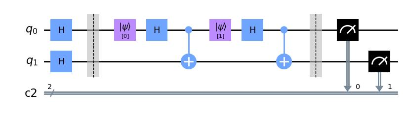

# QuantumReservoirPy

Using quantum circuits as reservoirs in reservoir computing is fairly new. The current examples in the literature rely heavily on quantum circuits of a very periodic nature. This package is meant to simplify the creation and simulation of such periodic circuits.

[See the documentation for this package.](https://quantumreservoirpy.readthedocs.io/)

## Installation
QuantumReservoirPy is available as a pip-installable package on [PyPI](https://pypi.org/project/quantumreservoirpy/).

```console
pip install quantumreservoirpy
```

This will install QuantumReservoirPy along with its dependent packages.

### Alternative Options

Alternatively, you may clone the repository from GitHub

```console
git clone https://github.com/OpenQuantumComputing/quantumreservoirpy.git
```

navigate to the repository

```console
cd quantumreservoirpy
```

and install it from here.

```console
pip install .
```

This is functionally equivalent to installing from PyPI.

## Interface

The interface of this package is somewhat inspired by [ReservoirPy](https://github.com/reservoirpy/reservoirpy). Consider checking out their tutorials to better understand this package.

A *reservoir* is in this package defined as a class implementing the abstract class `QReservoir`. To create a completely custom reservoir, you need to implement 5 functions as shown.

```python
class CustomRes(QReservoir):
    def before(self, circuit):
        pass
    def during(self, circuit, timestep):
        pass
    def after(self, circuit):
        pass

    def run(self, timeseries, **kwargs):
        pass
    def predict(self, num_pred, model, from_series, **kwargs):
        pass
```

QuantumReservoirPy has some partially implemented reservoirs already, which have easier interfaces.

## Static and Incremental

These reservoirs have implemented the `run` and `predict` methods, so you only need to implement `before`, `during`, and `after`.

All the reservoirs created with `Static` and `Ìncremental` have the same three layered circuit structure; they begin with an initialization, which is defined by `before`. Then, a small circuit is created for every timestep in the timeseries, which is defined by `during`. The third and last layer is defined by `after`.

```python
from quantumreservoirpy.reservoirs import Static
class CustomRes(Static):
    def before(self, circuit):
        circuit.h(circuit.qubits)
        circuit.barrier()

    def during(self, circuit, timestep):
        circuit.initialize(str(timestep), [0])
        circuit.h(0)
        circuit.cx(0, 1)

    def after(self, circuit):
        circuit.barrier()
        circuit.measure_all()

res = CustomRes(n_qubits=2)
res.circuit([0, 1]).draw('mpl')
```


The three functions `before`, `during`, and `after` do the same thing for both `Static` and `Incremental` reservoirs. The difference between them is what happens when the reservoirs are run.

## Running a Reservoir

Having created a reservoir, you can simply call `reservoir.run`.

```python
states = res.run(timeseries)
```

This will return a `np.ndarray` of the same length as the timeseries, corresponding to the reservoir state at each timestep.

`Static` reservoirs run once and all measurements are reshaped to a `(len(timeseries), -1)` shape.

`Incremental` reservoirs run incrementally. For every state, only the last `M` steps of the timeseries is built at a time (`M` being a parameter of `Incremental.__init__`).

## About

You can find out more about QuantumReservoirPy and contact the authors [here](https://quantumreservoirpy.readthedocs.io/en/latest/about/).

This project is supported by [SINTEF Digital](https://www.sintef.no/en/digital/).


*Teknologi for et bedre samfunn*
