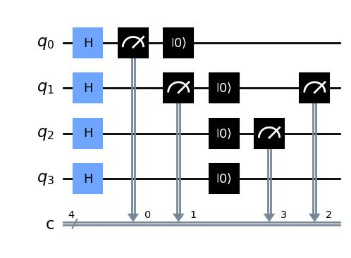
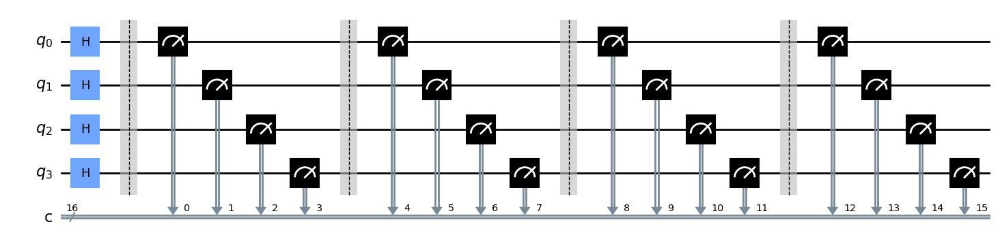
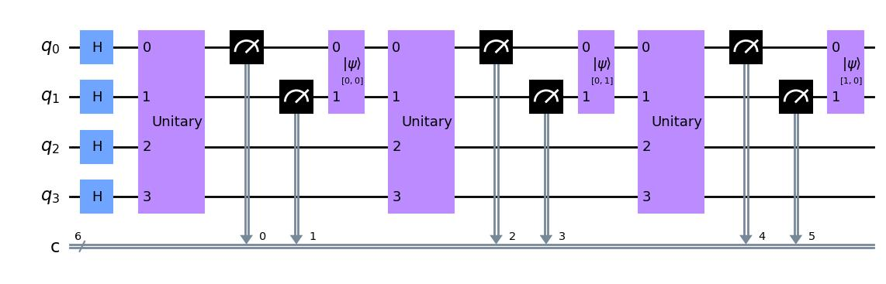

# Quantum Reservoir Computing (QRC)

## Simple Layers
```python
from qreservoirpy import QReservoir, Layers
res = QReservoir(qubits=4, layers=[
    Layers.H(),
    Layers.Measurement(measure_qubits=[0, 1]),
    Layers.Reset(),
    Layers.Measurement(measure_qubits=[1, 2])
])
res.circuit.draw('mpl')
```


When the `QReservoir` is run or drawn, it creates a `QuantumCircuit` and loops through the *layers* variable, appending to the circuit.
## Timeseries

By far the most important Layer, is `Layers.Timeseries`. This layer creates a highly customizable periodic circuit used to specify what measurements and/or operations to be done for every timestep.
### Simple usage
Consider the code below.

```python
from qreservoirpy import QReservoir, Layers
def build_method(circuit, timestep):
    circuit.barrier()
    circuit.measure(circuit.qubits)
    return circuit

res = QReservoir(qubits=4, layers=[
    Layers.H(),
    Layers.Timeseries(build_method=build_method)
])
res.run([0, 1, 2])
fig = res.circuit.draw('mpl')
```



### `build_method`
The Timeseries Layers takes has an argument `build_methods` which is a function of the format
```python
def build_method(circuit, timestep):
    # Append operation to circuit for each timestep
    return circuit
```
This method specifies what to happen for every timestep, when the reservoir is later run on a timeseries. You must append operations to *circuit* and return the finished circuit at the end.

The *circuit* variable is (almost) a qiskit [QuantumCircuit](https://qiskit.org/documentation/stubs/qiskit.circuit.QuantumCircuit.html) object, and you can expect that all operations given by qiskit work. The only difference is how one specifies the measurements. `circuit.measure(qbit, clbit)` from qiskit has been replaced by `circuit.measure(qbit)`. This was done for two reasons:
- To avoid having to create classical registers in `build_method`
-  To remove the necessity of passing the number of measurements already made into `build_method`

Both of these choices made the implementations of `build_method`'s more user-friendly.

The *timestep* variable is a single timestep, and must be of dimension `(1, n)`.

### Adding parameters to `build_method`
Consider the case where `build_method` should append an operator to the circuit which depend on `timestep`. To allow for this, one could add extra variables to `build_method`, provided that one provides the extra argument as key-value-pairs when initializing `Layers.Timeseries`. An example is shown below

```python
from qreservoirpy import QReservoir, Layers
from qiskit.quantum_info import random_unitary

def build_method(circuit, timestep, operators, encoder):
    circuit.unitary(operators[timestep], circuit.qubits)
    circuit.measure([0, 1])
    circuit.initialize(encoder[timestep], [0, 1])
    return circuit


timeseries = [0, 1, 2]
res = QReservoir(qubits=4, layers=[
    Layers.H(),
    Layers.Timeseries(build_method=build_method,
        operators = {key : random_unitary(2**4) for key in timeseries},
        encoder = {
            0: '00',
            1: '01',
            2: '10',
            3: '11'
        })
])
res.run(timeseries)
fig = res.circuit.draw('mpl')
```


## Interface
To bettter understand how to use qreservoirpy, consider checking out the package [reservoirpy](https://github.com/reservoirpy/reservoirpy), whose interface served as inspiration.

With a functioning `QReservoir`, simply use the method `run(timeseries)` to drive the quantum reservoir. `run` will create the quantum circuit and perform the experiment specified by the initialization of the reservoir.

