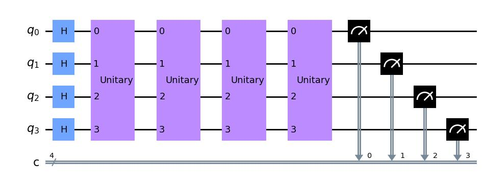
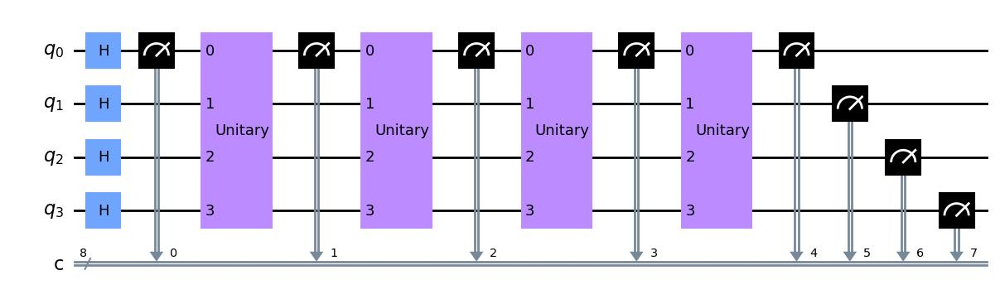

# Quantum Reservoir Computing (QRC)
## Installation
The *qreservoirpy* folder is structured as a python package and must therefore be pip installed. Navigate to the outer qreservoirpy/ folder (the one with setup.py in it) and run
```console
~/ReservoirComputingExamples/qreservoirpy pip install .
```
This will install qreservoirpy, as well as the dependent packages (among others qiskit and scikit-learn)

## Interface
The interface of this package is heavily inspired by  [reservoirpy](https://github.com/reservoirpy/reservoirpy). Consider checking out their tutorials to better understand this package.

Using a reservoir is simple enough;
```python
from qreservoirpy import QReservoir
res = QReservoir(INIT)
timeseries = [0, 1, 2, 3]
states = res.run(timeseries)
```

The above code will embed the one-dimensional `timeseries` into a higher dimensional space using a quantum circuit. However, the exact nature of this embedding depends strongly on what you write as `INIT`. The rest of this README is dedicated to the creation of `QReservoir`s.
## Simple Layers
`QReservoir` has two main arguments: `qubits`, which specify the number of qubits the circuit should use, and `layers`, which is described below. The rest of the arguments are explained later.

Some layers are more intuitive than others. Below, for exdample, are three layers which correspond to some of `qiskit`'s own operations.

```python
from qreservoirpy import QReservoir, Layers
res = QReservoir(qubits=4, layers=[
    Layers.H(),
    Layers.Measurement(measure_qubits=[0, 1]),
    Layers.Reset(),
    Layers.Measurement(measure_qubits=[1, 2])
])
res.circuit.draw('mpl')
```


When the `QReservoir` is run or drawn, it creates a `QuantumCircuit` and loops through the *layers* variable, appending to the circuit.
## Timeseries

By far the most important Layer, is `Layers.Timeseries`. This layer creates a highly customizable periodic circuit used to specify what measurements and/or operations to be done for every timestep. The following example
```python
from qreservoirpy import QReservoir, Layers
def build_method(circuit, timestep):
    circuit.barrier()
    circuit.measure(circuit.qubits)
    return circuit

res = QReservoir(qubits=4, layers=[
    Layers.H(),
    Layers.Timeseries(build_method=build_method)
])
res.run([0, 1, 2])
fig = res.circuit.draw('mpl')
```


### `build_method`
The Timeseries Layers takes as an argument `build_methods` which is a function of the format
```python
def build_method(circuit, timestep):
    # Append operation to circuit for each timestep
    return circuit
```
This method specifies what to happen for every timestep, when the reservoir is later run on a timeseries. You must append operations to *circuit* and return the finished circuit at the end.

The *circuit* variable is (almost) a qiskit [QuantumCircuit](https://qiskit.org/documentation/stubs/qiskit.circuit.QuantumCircuit.html) object, and you can expect that all operations given by qiskit to work. The only difference is how one specifies the measurements. `circuit.measure(qbit, clbit)` from qiskit has been replaced by `circuit.measure(qbit)`. This was done for two reasons:
- To avoid having to create classical registers in `build_method`
-  To remove the necessity of passing the number of measurements already made into `build_method`

Both of these choices made the implementations of `build_method`'s more user-friendly.

The *timestep* variable is a single timestep, and must be of dimension `(1, n)`.

### Adding parameters to `build_method`
Consider the case where `build_method` should append a time dependent (i.e. depending on `timestep`) operator to the circuit. To allow for this, one can add extra variables to `build_method`, as long as the same variable is provided as a key-value-pair argument when initializing `Layers.Timeseries`. An example is shown below

```python
from qreservoirpy import QReservoir, Layers
from qiskit.quantum_info import random_unitary

def build_method(circuit, timestep, operators, encoder):
    circuit.unitary(operators[timestep], circuit.qubits)
    circuit.measure([0, 1])
    circuit.initialize(encoder[timestep], [0, 1])
    return circuit


timeseries = [0, 1, 2]
res = QReservoir(qubits=4, layers=[
    Layers.H(),
    Layers.Timeseries(build_method=build_method,
        operators = {key : random_unitary(2**4) for key in timeseries},
        encoder = {
            0: '00',
            1: '01',
            2: '10',
            3: '11'
        })
])
res.run(timeseries)
fig = res.circuit.draw('mpl')
```


### `Incrementally=True`
Many features of `qreservoirpy` was implemented to reproduce the work of [[1]](#1). One of them, is the keyword `Incrementally`.

Consider the following code
```python
from qreservoirpy import QReservoir, Layers
from qiskit.quantum_info import random_unitary

def build_method(circuit, timestep, operator):
    circuit.unitary(operator, circuit.qubits)
    return circuit


timeseries = [0, 1, 2]
res = QReservoir(qubits=4, layers=[
    Layers.H(),
    Layers.Timeseries(
        build_method=build_method,
        operator = random_unitary(2**4)
        ),
    Layers.Measurement(range(4))
], incrementally=True)
res.run(timeseries)
fig = res.circuit.draw('mpl')
```


It looks like this only did four measurements. However, `incrementally=True` means that the `Timeseries` Layer was incrementally added, meaning that the above code actually ran 3 simulations:
- First with `timeseries=[0]`
- Second with `timeseries=[0, 1]`
- Third with `timeseries=[0, 1, 2]`

The `circuit.draw` is therefore misleading in this case: the code does not use the same circuit, but creates a new one for each timestep.

To add non-linearities, one could be tempted to make measurements in the timeseries like below

One needs to be careful, however, when doing this with `incrementally=True`. By default, when the 'incremental' experiments are run, it appends *all* measurements to the state variable - including the 'nonlinearity-ensuring' ones. To have complete control over which measurements that should be used as state variables, give the `QReservoir` an `analyze_function`, like in the code below.
```python
from qreservoirpy import QReservoir, Layers
from qiskit.quantum_info import random_unitary

def analyze_fcn(sim_result):
    return sim_result[-4:]

def build_method(circuit, timestep, operator):
    circuit.measure(0)
    circuit.unitary(operator, circuit.qubits)
    return circuit


timeseries = [0, 1, 2]
res = QReservoir(qubits=4, layers=[
    Layers.H(),
    Layers.Timeseries(
        build_method=build_method,
        incrementally=True,
        operator = random_unitary(2**4),
        ),
    Layers.Measurement(range(4))
], analyze_function=analyze_fcn)
res.run(timeseries)
```

`analyze_fcn` will ensure that only the last four measurements (the ones from the measurement layer) are kept as state variables. The above code was used to create the last timeseries.

### `M`
When `Incrementally=True`, one could want to only make a subset of the circuit, rather than using the entire timeseries every experiment. The `M` argument does exactly this. If `Incrementally=True` and `M = 4`, a call to `res.run([0, 1, 2, 3, 4, 5])` would result in the following 'incremental' experiments:

- `timeseries=[0]`
- `timeseries=[0, 1]`
- `timeseries=[0, 1, 2]`
- `timeseries=[0, 1, 2, 3]`
- `timeseries=[1, 2, 3, 4]`
- `timeseries=[2, 3, 4, 5]`

Where only the last `M` timesteps are used at a time.

By default, `M=np.inf`.

## Custom layers
There are, of course, circuits that are impossible to create using the already existing framework. If one needs a new layer altogether, you can easily create one.

In the qreservoirpy/Layers.py file, there is an absract base-class of the form

```python
class Layer(ABC):

    # When this function is called on a layer,
    # it should return an integer overestimating the number
    # of measurements the layer is going to perform.
    @abstractmethod
    def get_num_measurements(self, qreg, timeseries):
        return 0

    # Main build method for layer. Append operations to the
    # end of the circuit, and return the finished circuit.
    # **kwargs correspond directly to key-word-arguments provided
    # when initializing the reservoir, and are available for use.
    @abstractmethod
    def build(self, circuit, timeseries, **kwargs):
        return circuit
```

Create your custom layer in the Layers.py file by subclassing `Layer`. Feel free to draw inspiration from the other layers in the file.
## References
<a id="1">[1]</a>
Chen et al. (2020)
[*Temporal Information Processing on Noisy Quantum Computers*](https://link.aps.org/doi/10.1103/PhysRevApplied.14.024065),


